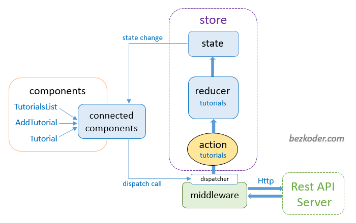

# **React Notes**

## **JSX**
[JSX](https://reactjs.org/docs/introducing-jsx.html) is an extension to the JavaScript syntax. We recommend using it with React to describe what the UI should look like. JSX may remind you of a template language, but it comes with all the power of JavaScript.

[exercise 1: JSX interpolation](1_JSX_interpolation.html).

## **Class-based vs Function-base components**

**Functional components:** These types of components do not have a state of their own and only possess a render method. They are also referred to as stateless components. They may by way of props (properties), derive data from other components.

```JS
const App = () => {
  return <h1>Hi there!</h1>;
}
```

**Class components:** These types of components hold and manage their unique state and have a separate render method to return JSX on the screen. They are referred to as stateful components too, as they can possess a state.
```JS
class App extends React.Component {
  render() {
    return <h1>Hi there!</h1>;
  }
}
```

## **Props**
System for passing data from a parent component to a child component. goal is customize or configure a child component.

```JS
const SimpleBanner = props => {

    return (
        <>
            <h4 class="ui header">{props.header}</h4>
            <p>{props.banner}</p>
        </>
    );
}
```

```JS
const SimpleButton = props => {

    return (
        <>
            <div className="ui icon header">
                <i className="pdf file outline icon"></i>
                {props.header}
            </div>
            <div className="ui primary button">{props.button}</div>
        </>
    );
}
```
### **Passing values as props**
```JS
const App = () => {

    return (
        <>
            <SimpleButton
                header="No documents are listed for this customer."
                button="add document"
            />
            <SimpleBanner
                header="For Your Information"
                banner="Pellentesque habitant morbi tristique..."
            />
        </>
    );
}

```

### **Passing components as props**
```JS
const Segment = props => {
    
    return (
        <div className="ui placeholder segment">
            {props.children}
        </div>
    );
}
```

```JS
const App = () => {
    
    return (
        <div>
            <Segment>
                <SimpleButton
                    header="No documents are listed for this customer."
                    button="add document"/>
            </Segment>
            <Segment>
                <SimpleBanner
                    header="For Your Information"
                    banner="Pellentesque habitant morbi tristique..."/>
            </Segment>
        </div>
    );
}
```
[exercise 2: props](2_props.html).

[exercise 3: children through props](3_children_through_props.html).

[exercise 4: class-based components](4_class_based_components.html).


## **States**
The state is a built-in React object that is used to contain data or information about the component. A component’s state can change over time; whenever it changes, the component re-renders. The change in state can happen as a response to user action or system-generated events and these changes determine the behavior of the component and how it will render. 


```JS
class App extends React.Component {
  constructor(props) {
    super(props);
    // define proper state object 
    this.state = {
      latitude: null,
      errorMessage: null,
    };
  }

  render() {
    // API for geolication
    window.navigator.geolocation.getCurrentPosition(
      position => {
        // change state of latitude using setState method
        this.setState({latitude: position.coords.latitude})
      },
      error => {
        // change state of errorMessage using setState method 
        this.setState({errorMessage: error.message}
      }),
    );
    
    return (
      <>
        {!this.state.errorMessage ? (
          <Display latitude={this.state.latitude} />
        ) : (
          <div>error: {this.state.errorMessage}</div>
        )}
      </>
    );
  }
}
```

## **Communicating Child to Parent**

<div align="center">
<table>
<tr>
<th> Parent component </th>
<th> Child component </th>
</tr>
<tr>

<td>

```JS
class App extends React.Component {

  /**
   * parent component provides a callback in order
   * to extract information by child component
   */
  onSubmitForm(term) {
    console.log(term);
  }; 

  render() {
    return (
      <div
        className="ui container"
        style={{ marginTop: "10px" }}>
        <SearchBar
          onSubmit={this.onSubmitForm}
        />
      </div>
    );

  }
}
```
</td>
<td>
    
```JS
class SearchBar extends React.Component {
    state = {term: ''};

    onSubmitForm = event => {
        event.preventDefault();
        /**
         * parent component provides a callback in order
         * to extract information by child component
         */
        this.props.onSubmit(this.state.term);
    }; 

    setTerm = event => {
        this.setState({term: event.target.value})
    }

    render() {
        return (
            <div className="ui segment">
                <form
                    className="ui form"
                    onSubmit={this.onSubmitForm}
                >
                    <div className="field">
                        <label>Image search</label>
                        <input
                            type="text"
                            value={this.state.term}
                            onChange={this.setTerm}
                        />
                    </div>
                </form>
            </div>
        );
    }
}

```
</td>
</tr>
</table>
</div>

## **Lifecycle on class-based components**

| **class methods**        | **lifecycle**                                   |                                                            |
|--------------------------|-------------------------------------------------|------------------------------------------------------------|
| **constructor**          |                                                 | good place to one-time setup                               |
| **render**               | content visible on screen                       | void doing anything besides returning JSX                  |
| **componentDidMount**    | waiting for updates...                          | good place to do data-loading                              |
| **componentDidUpdate**   | waiting until this component is no longer shown | good place to do more data-loading when state/props change |
| **componentWillUnmount** |                                                 | good place to do clean up                                  |


[exercise 5: updating components with state](5_updating_components_with_state.html).

[exercise 6: receiving values from controlled elements](6_receiving_values_from_controlled_elements.html).

[exercise 7: list building](7_list_building.html).

## **Hooks**
Hooks are functions that let you “hook into” React state and lifecycle features from function components. Hooks don’t work inside classes. React provides a few built-in Hooks like ```useState``` and ```useEffect```. You can also create your own Hooks to reuse stateful behavior between different components.

[exercise 8: ```useState```](8_usestate.html).

[exercise 9: ```useState``` and ```useEffect```](9_practicing_usestate_useeffect.html).

[exercise 10: custom hooks](10_custom_hooks.html).

## **Redux**
React Redux is the official React UI bindings layer for Redux. It lets your React components read data from a Redux store, and dispatch actions to the store to update state.

<p align="center">
  
</p>

[exercise 11: extracting more data from redux](11_extracting_more_data_from_redux/src/App.js).

[exercise 12: connecting redux](12_connecting_redux.html).

[exercise 13: adding reduce case](13_adding_reduce_case.js).

## **Routing**

React Router is a collection of React components, hooks and utilities that make it easy to build multi-page applications with React. 

[exercise 14: adding another route](14_another_route/src/App.js).

## **Modals with React portals**
Portals provide a first-class way to render children into a DOM node that exists outside the DOM hierarchy of the parent component.

[exercise 15: closing modal](15_closing_modal/src/App.js).

## **Other stuff**

[exercise 16: filtering stream list](16_filtering_stream_list/src/App.js).

[exercise 17: consuming context](17_consuming_context/src/App.js).