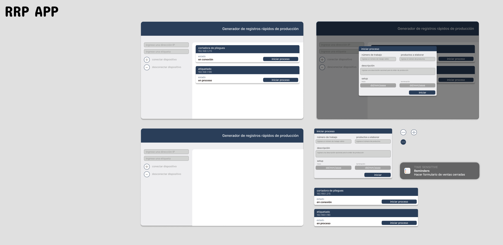
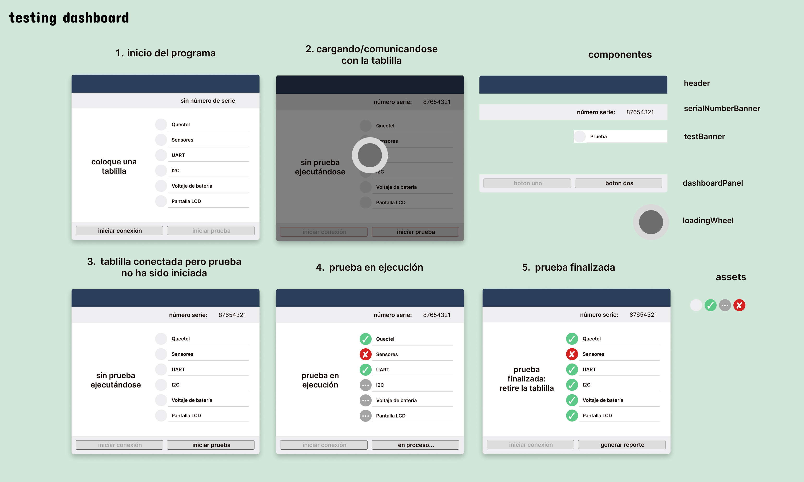
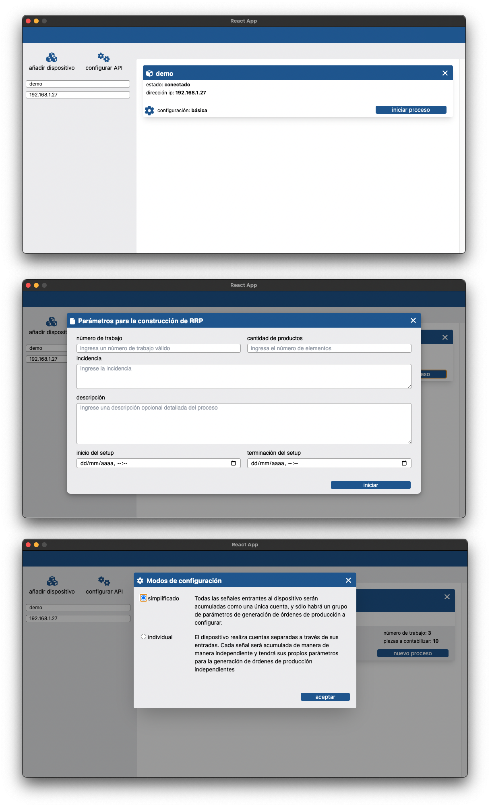

# **React Projects**

I worked in different kinds of projects in roder to implement the concepts saw in course and other references.

## Vog react challenge
In this project I applied the concepts that I had not yet studied in the udemy course; i implemented redux in a simple way and used react bootstrap to style the components

## RRP App

  

It is a desktop application (implementing electronjs to establish communication with devices like Arduino) that I started building without taking into account some good practices, it was simply to familiarize myself with the use of components, properties and hooks, as well as to gain more confidence in when adding styling (I used pure CSS) and I design mockups in figma for reference.

## testing dashboard

  

It is a desktop application that simulates the evaluation of an electronic prototype communicating through a serial port. I establish the business logic in one of the components (the main button) and the information is propagated to the other components, indicating the result of the tests to the user. I implemented custom hooks to make the code more readable. I design mockups in figma for reference and I also started to implement Tailwind CSS in all components.

## RRP App version 2

  

I refactored RRP App to implement a simpler architecture and to make the components and logic easier to understand, I also changed all the styles made in CSS for utility classes in Tailwind.